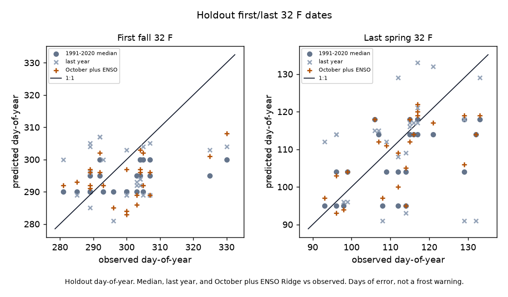
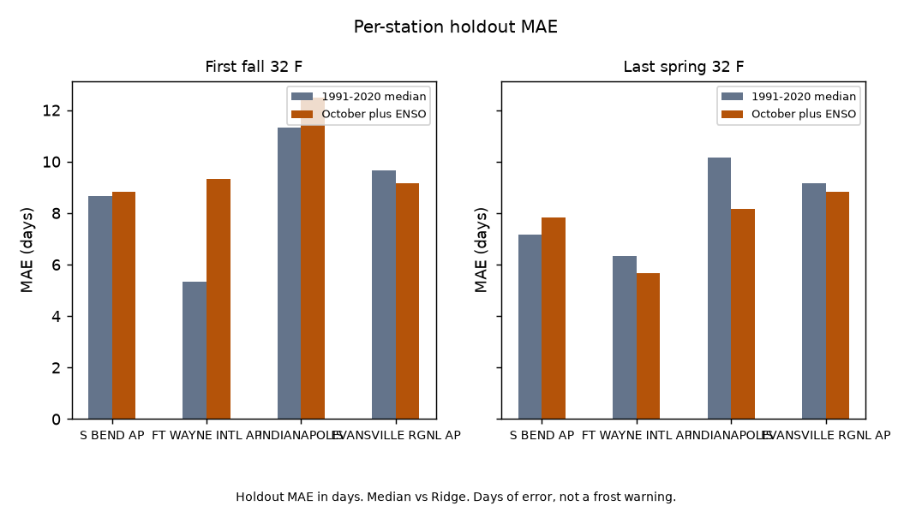

# Indiana first/last 32 °F dates: October plus ENSO vs 1991-2020 median

Does October plus ENSO beat the 1991-2020 median first/last 32 °F date at held-out Indiana GHCND cores?

No on first fall; yes on last spring. Locked `d861556`. Holdout Ridge MAE is 9.96 days vs the 1991-2020 median 8.75 on first fall, and 7.62 vs 8.21 on last spring. That split is the product. Do not average it. Parent last-year vs median is frozen at `28941fb` in [indiana_freeze_date](https://github.com/martialsystems/indiana_freeze_date) (11.67 vs 8.75 fall; 11.38 vs 8.21 spring). Last year is a bar here, not the question. Valparaiso is not in this tree. Fixture skill does not rescue live. Pages stay off.

[](https://github.com/martialsystems/indiana_freeze_date) [](https://gist.github.com/martialsystems/e5de316dbb5f672573906572730e3735) [](https://martialsystems.github.io/indiana_wx_pages/)

Holdout n=24 station-seasons per target on the four cores (fall 2019-2024, spring 2020-2025). Train: fall 1991-2018 and spring 1991-2019. Confirmation fall 2025 / spring 2026 is out of train and out of the median.

Four cores: South Bend `USW00014848`, Fort Wayne `USW00014827`, Indianapolis `USW00093819`, Evansville `USW00093817`.



Figure 1. Holdout day-of-year. Median, last year, and October plus ENSO Ridge vs observed. Days of error, not a frost warning.



Figure 2. Holdout MAE in days. Median vs Ridge. Days of error, not a frost warning.

## Live skill (held-out seasons)

Locked from `logs/in_live/stage_c_report.json`. Days. Four cores. 7/24 counts are not the method.

| Target | Median MAE | Last year MAE | Ridge MAE | Median RMSE | Last year RMSE | Ridge RMSE |
|--------|-----------:|--------------:|----------:|------------:|---------------:|-----------:|
| First fall 32 °F | 8.75 | 11.67 | 9.96 | 11.46 | 13.24 | 11.88 |
| Last spring 32 °F | 8.21 | 11.38 | 7.62 | 10.55 | 15.68 | 9.64 |

### Per station

| Station | Target | Median MAE | Last year MAE | Ridge MAE |
|---------|--------|-----------:|--------------:|----------:|
| South Bend `USW00014848` | First fall | 8.67 | 10.50 | 8.83 |
| South Bend `USW00014848` | Last spring | 7.17 | 7.00 | 7.83 |
| Fort Wayne `USW00014827` | First fall | 5.33 | 10.00 | 9.33 |
| Fort Wayne `USW00014827` | Last spring | 6.33 | 11.00 | 5.67 |
| Indianapolis `USW00093819` | First fall | 11.33 | 15.17 | 12.50 |
| Indianapolis `USW00093819` | Last spring | 10.17 | 14.00 | 8.17 |
| Evansville `USW00093817` | First fall | 9.67 | 11.00 | 9.17 |
| Evansville `USW00093817` | Last spring | 9.17 | 13.50 | 8.83 |

Train-era median dates (month-day): South Bend 17 Oct / 28 Apr, Fort Wayne 17 Oct / 24 Apr, Indianapolis 22 Oct / 14 Apr, Evansville 27 Oct / 5 Apr.

Evansville Ridge beats the median on both targets. South Bend Ridge loses both. Fort Wayne and Indianapolis win last spring only. Those rows stay in the station table.

Confirmation fall 2025 / spring 2026 Ridge MAE 6.00 vs median 7.25 (fall) and 13.00 vs 11.75 (spring) does not reopen a page. Fixture skill does not rescue live.

## Stage 0

Synthetic first/last 32 °F dates at the four cores with a planted ENSO-date link. Fixture Ridge MAE 2.25 vs median 4.58 (fall) and 1.71 vs 3.71 (spring). That does not rescue live skill.

```bash
python3.12 -m venv .venv
source .venv/bin/activate
pip install -r requirements.txt
PYTHONPATH=src:. python3 scripts/run_fixture.py logs/stage0_fixture
.venv/bin/python -m pytest tests -q
PYTHONPATH=src:. python3 scripts/run_live.py logs/in_live data/raw
```

Empty GHCND TMIN for a required core stops (`run_live.py` exit 2). Two figures max.

| File | Role |
|------|------|
| [METHODOLOGY.md](METHODOLOGY.md) | Locked contract |
| [AGENTS.md](AGENTS.md) | Agent rules |
| [CHECKLIST.md](CHECKLIST.md) | Operator list |
| `src/frzenso/` | GHCND TMIN, prior-year October, Niño 3.4, Ridge, figures |
| `ensoforge/` | GraphForge pin |

[](https://martialsystems.github.io/indiana_wx_pages/)
